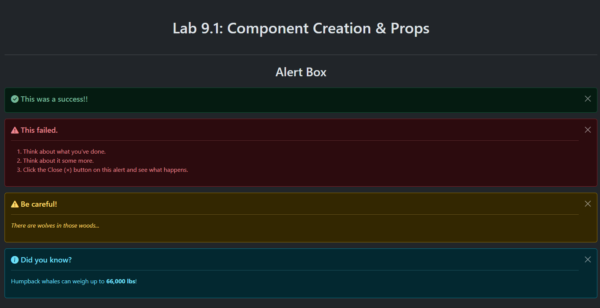

# Lab 9.1: Component Creation and Props

[Karl Johnson](https://github.com/hirekarl)  
2025-RTT-30  
<time datetime="2025-07-23">2025-07-23</time>  



## Overview
### Viewer Instructions
1. Run the following in the terminal:

```bash
cd component-library && npm i && npm run dev
```

2. Navigate in the browser to [`localhost:5173`](http://localhost:5173).

### Submission Source
Top-level application behavior can be found at [`App.tsx`](./component-library/src/App.tsx).

### Component Usage Documentation
#### `AlertBox`
##### Props

| prop | type | usage |
|---|---|---|
|`type`|`AlertType`|The Bootstrap styling to use when rendering the `AlertBox`. Also signals which [Bootstrap Icon](https://icons.getbootstrap.com/) to display. Options are `"success" \| "danger" \| "warning" \| "info"`.|
|`message`|`string`|The message that is displayed at the top of the `AlertBox`, as a heading.|
|`onClose?`|`() => void`|Code to run when the `AlertBox` is closed.|
|`children?`|`React.ReactNode`|Any children passed from the parent Component.|

##### Usage
- To render, invoke `AlertBox` with at least props `type` (of type `AlertType`) and `message`.
- `type` specifies `"success" | "danger" | "warning" | "info"`, as specified and implemented by Bootstrap.
- `message` indicates the heading of the alert box.
- `onClose` runs code passed down from parent Component when the alert box is closed with the Close button.
- To include content in the body of the alert box, pass that content as children of the parent Component.
- See [`AlertBox.test.tsx`](./component-library/src/components/AlertBox/AlertBox.test.tsx) for demo implementation.


##### Example
```tsx
import AlertBox from "./src/components/AlertBox/AlertBox"

export default function AlertBoxParent() {
  function handleClose(): void {
    alert("This will show when the alert box is closed.")
  }

  return (
    <>
      <AlertBox type="danger" message="Operation failed." onClose={handleClose}>
        <p>Click the Close (&times;) button on this alert and see what happens.</p>
      </AlertBox>
    </>
  )
}
```

#### `UserProfileCard`
##### Notes
- `UserProfileCard`s are displayed in groups of four items per row on large screens.
- Parent Component must wrap `UserProfileCard`s in `<div class="row">`.

##### Props

| prop | type | usage |
|---|---|---|
|`user`|`User`|The `User` whose `UserProfileCard` to render.|
|`showEmail?`|`boolean`|Indicates whether to display `user`'s email address.|
|`showRole?`|`boolean`|Indicates whether to display `user`'s role.|
|`onEdit?`|`(userId: string) => void`|Code to run when "Edit" button is clicked.|
|`children?`|`React.ReactNode`|Any children passed from the parent Component.|

##### Usage
- To render, invoke `UserProfileCard` with at least prop `user` (of type User).
- `showEmail` indicates whether to display user's email address on the card.
- `showRole` indicates whether to display user's role on the card.
- Pass `children` from parent Component to add more detail.
- Component must be rendered under a `<div class="row">` in the parent Component to display correctly.
- See [`UserProfileCard.test.tsx`](./component-library/src/components/UserProfileCard/UserProfileCard.test.tsx) for demo implementation.

##### Example
```tsx
import { type User } from "./src/types"
import UserProfileCard from "./src/components/UserProfileCard/UserProfileCard"

export default function UserProfileCardParent() {
  const user: User = {
    id: "1",
    name: "John Smith",
    email: "email@example.com",
    role: "Manager",
    avatarUrl: "https://www.example.com/johnsmith.png",
  }

  function handleEditButtonClicked(id: string) {
    alert(`You clicked the "Edit" button for user with ID ${id}.`)
  }

  return (
    <div className="row">
      <UserProfileCard
        user={user}
        showEmail={true}
        showRole={true}
        onEdit={handleEditButtonClicked}>
        <p className="text-success">
          <small>{user} is a Pro user.</small>
        </p>
      </UserProfileCard>
    </div>
  )
}
```


#### `ProductDisplay`
##### Notes
- `ProductDisplay`s are displayed in groups of three items per row on large screens.

##### Props

| prop | type | usage |
|---|---|---|
|`product`|`Product`|The `Product` to display.|
|`showDescription?`|`boolean`|Indicates whether to show `product`'s description.|
|`showStockStatus?`|`boolean`|Indicates whether to show `product`'s stock status.|
|`onAddToCart?`|`(productId: string) => void`|Code to run when "Add to Cart" button clicked.|
|`children?`|`React.ReactNode`|Any children passed from the parent Component.|

##### Usage
- To render, invoke `ProductDisplay` with at least prop `product` (of type Product).
- `showDescription` indicates whether to display product's description.
- `showStockStatus` indicates whether to display product's "in stock" or "out of stock" status.
- `onAddToCart` runs code when the "Add to Cart" button is clicked.
- Pass `children` from parent Component to add more detail.
- Component must be rendered under a `<div class="row">` in the parent component to display correctly.
- See [`ProductDisplay.test.tsx`](./component-library/src/components/ProductDisplay/ProductDisplay.test.tsx) for demo implementation.

##### Example
```tsx
import { type Product } from "./src/types"
import ProductDisplay from "./src/components/ProductDisplay/ProductDisplay"

export default function ProductDisplayParent() {
  const item: Product = {
    id: "1",
    name: "A Generic Product",
    price: 0.99,
    description: "A plain, regular product."
    inStock: true,
    imageUrl: "https://www.example.com/product.png",
  }

  function handleAddToCart(id: string): void {
    alert(`You clicked the "Add to Cart" button for product with ID ${id}.`)
  }

  return (
    <div className="row">
      <ProductDisplay
        product={item}
        showDescription={true}
        showStockStatus={true}
        onAddToCart={handleAddToCart}>
        <p>Any extra details would go here.</p>
      </ProductDisplay>
    </div>
  )
}
```

### Reflection
#### 1. How did you handle optional props in your components?
> In `ProductDisplay`, I used an `if...else` clause to render a different JSX button depending on whether `onAddToCart` is provided or not. `UserProfileCard` only displays a button if an `onEdit` callback is sent as a prop. For the conditions specified by optional booleans, I used short-circuiting syntax to render associated JSX elements only when those booleans are truthy.

#### 2. What considerations did you make when designing the component interfaces?
> In the cases where children were accepted as props, I had to find an appropriate place in the Components to render the children. For both the `UserProfileCard` and `ProductDisplay`, I chose to display the additional content just above the button at the bottom of the card, if it exists.

#### 3. How did you ensure type safety across your components?
> I implemented the props interfaces when bringing props into functional React components, making sure the types of the props passed to those components conform to spec. I created an interface for `Section` and a custom `BootstrapIconClassOptions` for the Bootstrap Icons-related icons to ensure only valid icon classes are passed to the component.

#### 4. What challenges did you face when implementing component composition?
> No challenges, really. I figured out early on that I could use the `.test.tsx` files as an opportunity to demonstrate various use cases, and that I could compose the different sections together using a `Section` React functional component that accepts children.

## Assignment
### Lab Overview
In this lab, you will create a set of reusable UI components for your company’s internal component library. You will practice creating TypeScript React components with proper prop typing, component composition, and prop handling. This lab focuses on **component creation**, **TypeScript interfaces**, **prop handling**, and **component composition** using React and TypeScript.

### Workplace Context
Imagine you are a frontend developer tasked with building a component library for your company’s internal applications. Your team needs a set of reusable, type-safe components that can be easily configured for different use cases. These components will be used across multiple applications, so they need to be well-documented, properly typed, and flexible enough to handle various scenarios.

This lab will help you practice building the foundational components that will be used throughout your company’s applications.

### Activity Tasks
#### 1. Component Implementation
- [x] Implement each component according to its interface requirements.
- [x] Use proper TypeScript types and interfaces.
- [x] Implement prop validation where appropriate.
- [x] Handle optional props and children correctly.

#### 2. Component Testing
- [x] Test different prop combinations.
- [x] Verify that components render correctly with various props.

#### 3. Component Composition
- [x] Create example usage of components working together.
- [x] Demonstrate prop passing between components.
- [x] Show how to handle component nesting.

#### 4. Documentation
- [x] Add comments to describe component props.
- [x] Create example usage documentation.
- [x] Document any special prop handling or requirements.

## Attributions
- Fidget Spinner image: By Árni Dagur - Own work, CC0, https://commons.wikimedia.org/w/index.php?curid=59361838